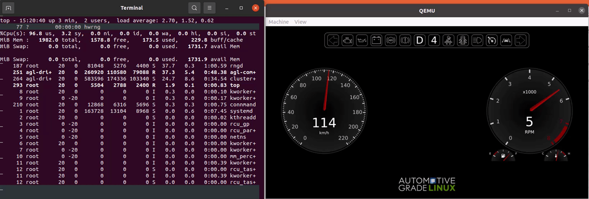

Automotive Grade Linux (AGL) is a collaborative, open-source project that brings together automakers, suppliers, and technology companies for the purpose of building Linux-based, open-source software platforms for automotive applications that can serve as de facto industry standards. AGL is providing 70-80% starting point for automakers this is a good option for student to learn about Automotive industry, linux, new techbology and maybe contribute in future with demos o new features fro mthis platform

AGL address all software in the vehicle like 
    Infotainment
	Instrument cluster
	Heads-up-display (HUD)
	Telematics
	Connected Car
	Advanced driver assistance systems (ADAS)
	Functional safety
	Autonomous driving
	Virtualization Projects

Those team follow this book and teh corresponding mentoring will be able to undertand 
    Sw versión control tool
    Linux system (Basic) WSL User
    Yocto Project
    Repo tool
    Automotive Grade Linux system 
    QT Basic
    CAN
    Code best practice 

And able to do in Linux
    Add new services
    Get Logging
    Modify Linux Kernel
    Implement services can interact with CAN Rx and Tx
    Create Basic QT application for AGL
    Modify Cluster Demo to handled Tacho, Speedometer and telltales  

