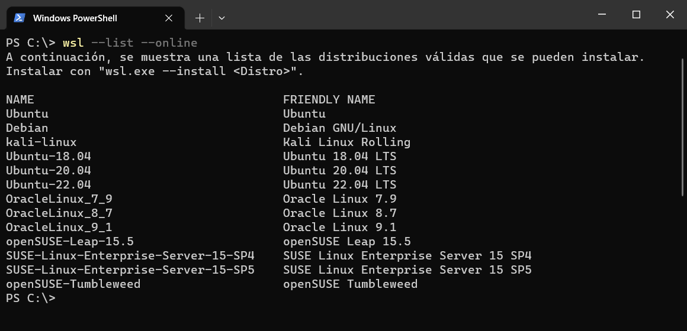
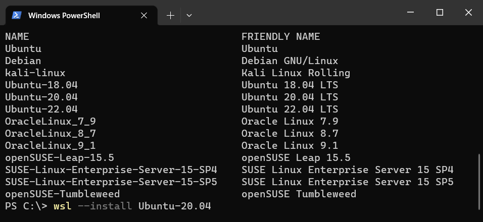
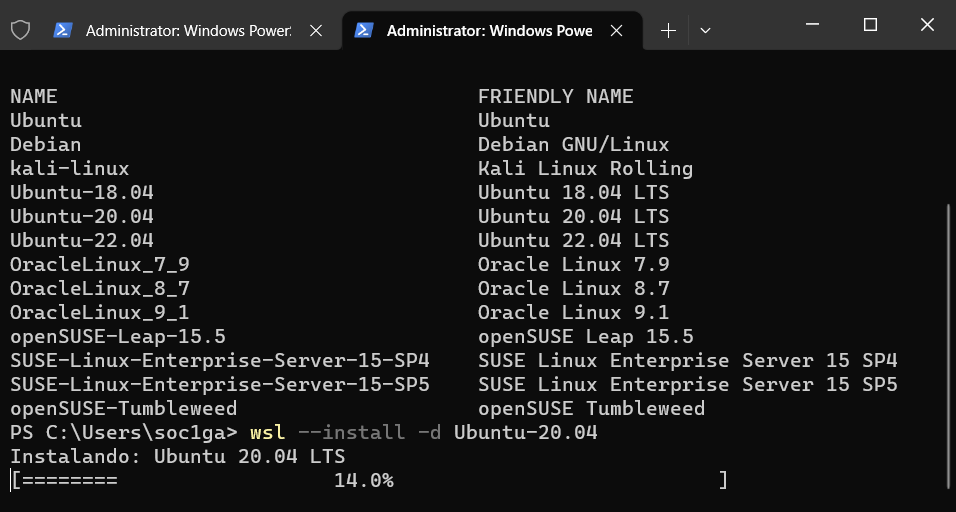
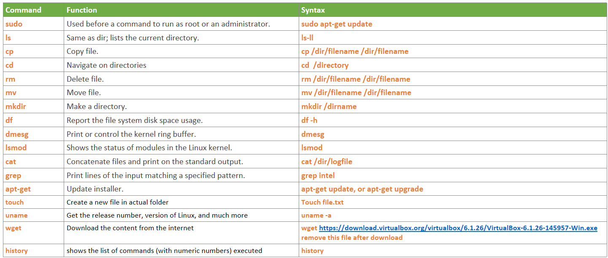

# What is WSL? 

> The Windows Subsystem for Linux lets developers run a GNU/Linux environment -- including most command-line tools, utilities, and applications -- directly on Windows, unmodified, without the overhead of a virtual machine 
or dualboot setup.
>> See complete overview [WSL](https://learn.microsoft.com/en-us/windows/wsl/about) 


## Why WSL

> WSL is a easy way to learn, undertand and develop on linux without any need to spend time installing linux (Any distribution) in your machine, the process to intall and use is simple and you can use most of the machine resources like complete CPUs and threads, 80% of RAM, share files and tools between windows and Linux.  

The bad for WSL is if we compare with Linux running directly in the PC is the performace, we will  lower performace in WSL and same distribution running directly in same PC, this is expected as WSL is running in parallel to windows and sharing resources between both OS. 
Not all is possible in this life easy intallation vs performace What you prefer? 

By the moment we chose WSL for start point and you will see the easy way to start to work in Linux following the steps described in next chapters.
	
## Start with WSL
	
> WSL have 2 different versions WSL1 and WSL2 we will use WSL2  as is version already tested for the project we will use in future. 

Start installation is simple you just need open CMD, powershell or Terminal windows and type next commands

First check the available distribution using this command 

```
wsl --list --online
```

>> 

Then type below command to install Ubuntu-20.04

```
wsl --install Ubuntu-20.04
```

>> 

Or if you type this command will install Ubuntu by default  

```
wsl --install
```

>> 

See [official page](https://learn.microsoft.com/en-us/windows/wsl/install) for more details. 


After previous commands you will see the installation progress like this 
>> 

Once this process completes you need provide user and password, for user name use lowercase if you use uppercase for user will get an error like in the red rectangles, good entry will ask for password if this is good 2 times installation will be completed successfully 
>> 

	
##  WSL Configuration
> WSL use 2 files to set the own configuration, the complete description of each configuration is available at this place: [wsl-config](https://learn.microsoft.com/en-us/windows/wsl/wsl-config)

1.- Internally to our Ubuntu \etc\wsl.conf, please create this file and add the below text

wsl.conf content:

```
# Set a command to run when a new WSL instance launches.
[boot]
systemd=true
```

2.- Externally ni Windows C:\Users\charly\.wslconfig
.wslconfig content: NOTE: memory, processors and swap options need to be adapted base on your PC

```
# Settings apply across all Linux distros running on WSL 2
[wsl2]
	
# How much memory to assign to the WSL2 should not excede 80% of total RAM memory
memory=12GB
	
# How many processors to assign to the WSL2 
processors=8
	
# Sets amount of swap storage space, default is 25% of available RAM
swap=8GB
	
# Sets swapfile path location, default is %USERPROFILE%\AppData\Local\Temp\swap.vhdx
swapfile=C:\\temp\\wsl-swap.vhdx
	
# Disables nested virtualization
nestedVirtualization=true
	
# Turns on output console showing contents of dmesg when opening a WSL 2 distro for debugging
debugConsole=false
	
#Boolean to turn on or off support for GUI applications (WSLg) in WSL.
guiApplications=true
```

Now restart WSL with this command  in windows terminal and after 8 second open new terminal 
wsl --shutdown

##  First Command in WSL
> Open Ubuntu terminal in your windows OS and we will start to use our distribution 

Update all components from Ubuntu distro and upgrade the system

```
sudo apt-get --assume-yes update && apt-get --assume-yes upgrade && apt-get clean
```

Install some required packages

```
sudo apt-get --assume-yes install curl nano wget apt-transport-https ca-certificates rsync filepp device-tree-compiler cmake libgtest-dev google-mock gcovr lcov pandoc mc texlive-fonts-recommended texlive-latex-recommended libc6-dev libxml2-dev libicu-dev git-core gnupg flex bison gperf build-essential zip curl zlib1g-dev gcc-7-multilib g++-7-multilib x11proto-core-dev libx11-dev ccache tofrodos gawk ant libxml2-utils libgl1-mesa-dev xsltproc unzip libssl-dev liblz4-tool openjdk-8-jdk libc6-dev-i386 lib32z-dev bc gettext u-boot-tools libjson-perl libterm-readkey-perl libmime-lite-perl libarchive-zip-perl libtext-glob-perl xmlstarlet jq adb fastboot sloccount dstat android-sdk-libsparse-utils android-sdk-ext4-utils python3.7 libncurses5 gawk wget git diffstat unzip texinfo gcc chrpath socat cpio python3 python3-pip python3-pexpect xz-utils debianutils iputils-ping python3-git python3-jinja2 libegl1-mesa libsdl1.2-dev pylint3 xterm python3-subunit mesa-common-dev
```

Try use the below commands in WSL:
>> 
	
Learn about command line commands - http://linuxcommand.org/tlcl.php
	
##  Backup WSL
> I recommend after all tool installation and before start work with any project in WSL create a Backup and save in safe location, in this way you can recover your WSL without any problem and not need spend time installing all the tools again
WSL have 2 command for this export and import command 

Backup Command:
```
wsl --export Ubuntu-20.04 path/where/save/backup/Ubuntu-20.04_backup.tar
```

Backup Recovery Command:

```
wsl --import Ubuntu-20.04  C:\Users\<username>\AppData\Local\Packages\Ubuntu-20.04 path/where/save/backup/Ubuntu-20.04_backup.tar
```
		
##  Alternatives to WSL
> In case WSL is not working, you can still use Ubuntu in Virtual box, just follow the [Virtual Box installation steps](https://ubuntu.com/tutorials/how-to-run-ubuntu-desktop-on-a-virtual-machine-using-virtualbox#1-overview) 

Warning: virtual machine require minimum 200GB storage space for project, please consider it during storage creation.

