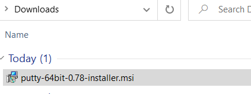
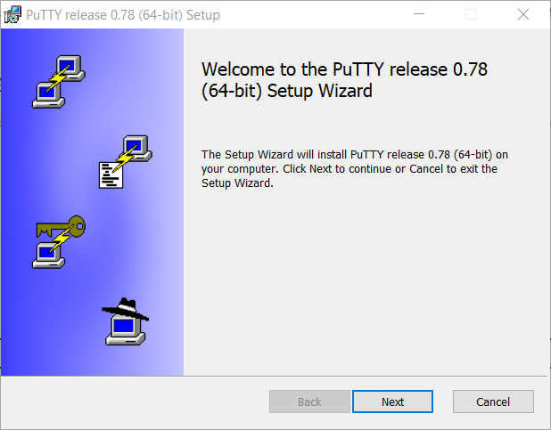
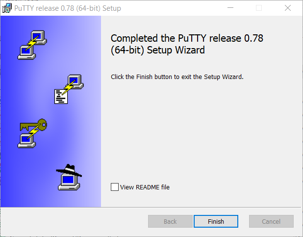

I. What is Putty? 
	PuTTY is a free and open-source terminal emulator, serial console and network file transfer application, this tool will be required to communicate with the OS from Cluster project. 

II. Putty installation 

	Download from https://www.putty.org/ 
		

	Install msi file 
	    
	
	Installation finished
		
	
	Open Putty looks like this, we willuse in future once we have firs project demo build. 
		
