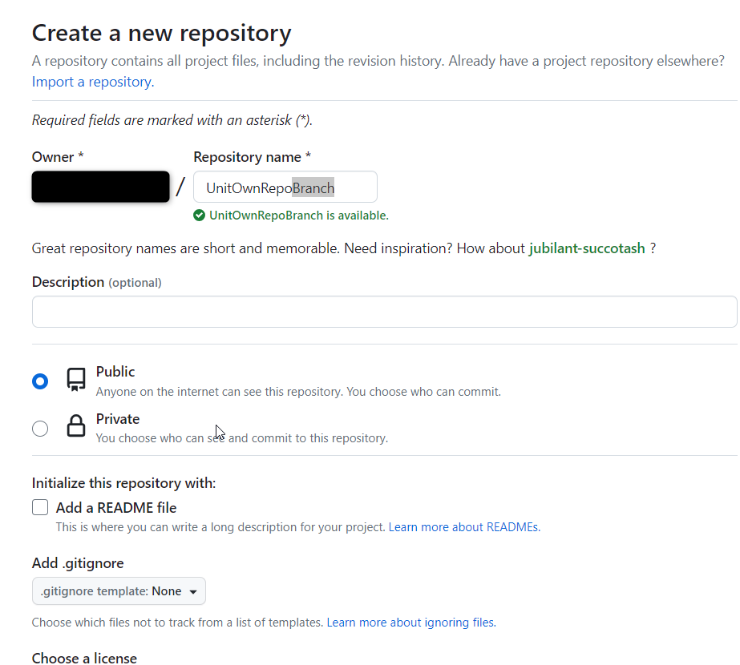
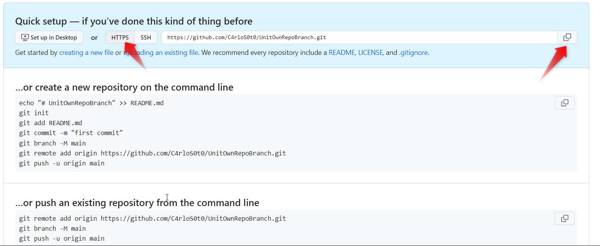
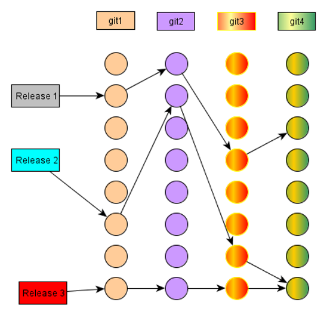
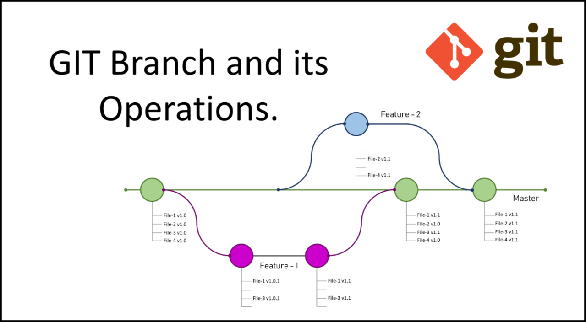

DRAFT

> Repo is a tool built on top of Git. Repo helps manage many Git repositories, does the uploads to revision control systems, and automates parts of the development workflow. Repo is not meant to replace Git, only to make it easier to work with Git. The repo command is an executable Python script that you can put anywhere in your path.


Installation commands: 
```
mkdir -p ~/.bin
PATH+=:~/bin
curl https://storage.googleapis.com/git-repo-downloads/repo > ~/.bin/repo
chmod a+rx ~/.bin/repo
echo 'PATH+=:~/bin' >> ~/.bashrc
```

>> See complete information in [official page](https://android.googlesource.com/tools/repo). 


Time to create our own repository 

```repo init  -u https://gerrit.automotivelinux.org/gerrit/AGL/AGL-repo```

Enter in manifest folder

```
cd manifests

git branch -a

git checkout -b UniTestBranch

la

touch unitest.xml

ls
```

Create commit and be ready to push
	
From GitHub create a empty repository 

>>> 
	
	
>>>> 
	


>>>>>> 


```	
git push --all -u https://github.com/C4rloS0t0/UnitOwnRepoBranch.git
```

A repo manifest describes the structure of a repo client; that is the directories that are visible and where they should be obtained from with git.
The basic structure of a manifest is a bare Git repository holding a single default.xml XML file in the top level directory.
Manifests are inherently version controlled, since they are kept within a Git repository. Updates to manifests are automatically obtained by clients during repo sync.

[See more details](https://gerrit.googlesource.com/git-repo/+/master/docs/manifest-format.md)




In Git, a branch is a new/separate version of the main repository.
Let's say you have a large project, and you need to update the design on it.

How would that work without and with Git:

Without Git:

	• Make copies of all the relevant files to avoid impacting the live version
	• Start working with the design and find that code depend on code in other files, that also need to be changed!
	• Make copies of the dependant files as well. Making sure that every file dependency references the correct file name
	• EMERGENCY! There is an unrelated error somewhere else in the project that needs to be fixed ASAP!
	• Save all your files, making a note of the names of the copies you were working on
	• Work on the unrelated error and update the code to fix it
	• Go back to the design, and finish the work there
	• Copy the code or rename the files, so the updated design is on the live version
	• (2 weeks later, you realize that the unrelated error was not fixed in the new design version because you copied the files before the fix)
	
With Git:

	• With a new branch called new-design, edit the code directly without impacting the main branch
	• EMERGENCY! There is an unrelated error somewhere else in the project that needs to be fixed ASAP!
	• Create a new branch from the main project called small-error-fix
	• Fix the unrelated error and merge the small-error-fix branch with the main branch
	• You go back to the new-design branch, and finish the work there
	• Merge the new-design branch with main (getting alerted to the small error fix that you were missing)
Branches allow you to work on different parts of a project without impacting the main branch.
When the work is complete, a branch can be merged with the main project.
You can even switch between branches and work on different projects without them interfering with each other.
Branching in Git is very lightweight and fast!

Creating branches
To start a topic branch using Repo:
$ repo start branchname

To verify that your new branch was created:
$ repo status

From <https://wladimir-tm4pda.github.io/source/git-repo.html> 


Using topic branches
To assign the branch to a particular project:
$ repo start branch name project

To switch back and forth among branches that you have created in your local work environment:
$ git checkout branchname

To see a list of existing branches:
$ git branch
or...
$ repo branches

The name of the current branch will be preceded by an asterisk.

From <https://wladimir-tm4pda.github.io/source/git-repo.html> 


https://wladimir-tm4pda.github.io/source/git-repo.html#:~:text=Repo%20command%20reference




