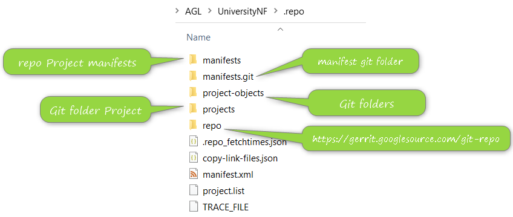
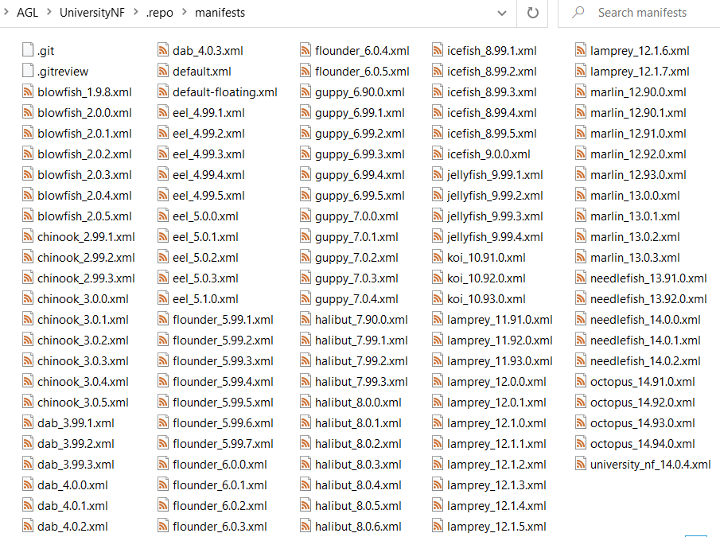
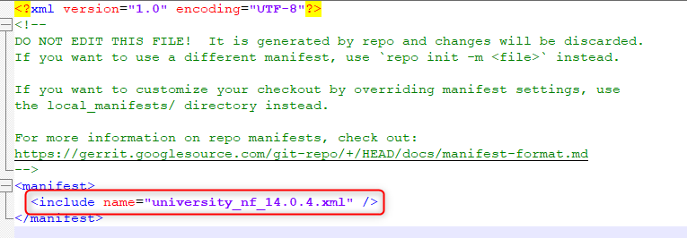
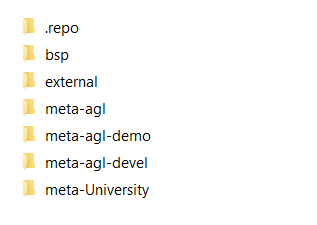

## Installation 

Use the below commands to install repo in your Linux distribution 

```
mkdir -p ~/.bin
PATH+=:~/bin
curl https://storage.googleapis.com/git-repo-downloads/repo  ~/.bin/repo
chmod a+rx ~/.bin/repo
echo 'PATH+=:~/bin'  ~/.bashrc
```

 See complete information in [Repo website](https://android.googlesource.com/tools/repo). 

## Command Repo

Repo tool have a set of commands, using the below command after repo tool install you will see complete list of Repo commands

```
repo help
```
Example output 
```
The complete list of recognized repo commands is:
  abandon        Permanently abandon a development branch
  branch         View current topic branches
  branches       View current topic branches
  checkout       Checkout a branch for development
  cherry-pick    Cherry-pick a change.
  diff           Show changes between commit and working tree
  diffmanifests  Manifest diff utility
  download       Download and checkout a change
  forall         Run a shell command in each project
  gitc-delete    Delete a GITC Client.
  gitc-init      Initialize a GITC Client.
  grep           Print lines matching a pattern
  help           Display detailed help on a command
  info           Get info on the manifest branch, current branch or unmerged branches
  init           Initialize a repo client checkout in the current directory
  list           List projects and their associated directories
  manifest       Manifest inspection utility
  overview       Display overview of unmerged project branches
  prune          Prune (delete) already merged topics
  rebase         Rebase local branches on upstream branch
  selfupdate     Update repo to the latest version
  smartsync      Update working tree to the latest known good revision
  stage          Stage file(s) for commit
  start          Start a new branch for development
  status         Show the working tree status
  sync           Update working tree to the latest revision
  upload         Upload changes for code review
  version        Display the version of repo
See 'repo help <command>' for more information on a specific command.
```
[See also](https://wladimir-tm4pda.github.io/source/git-repo.html#:~:text=Repo%20command%20reference) 

## Create Repo Project


Create your own AGL repository, first steps is create a new folder inside you folder user in WSL then inside this folder from command line type the next command, this will take some time depend of your connectivity

```repo init  -u https://gerrit.automotivelinux.org/gerrit/AGL/AGL-repo```

Once process is completed explore .repo folder, this is a hide folder but if the previous command completed successfully folder is there, each time you create a new repo this folder will exist, you will see something like below



Each folder have a specific usage but now you will focus on manifests folder, this folder is a git repository and inside you will see a complete set of XML files each file is a manifest file, you will see



From command line we can run next command to see the repository status
```
git status
```
Output will looks like this


As you can see Repo contain a git repository with multiple manifest and each manifest is a project configuration o version project, if we need select a specific manifest for our usage we need use below command, in this case we will use 

```
repo init -m needlefish_14.0.2.xml
```

If you want to now which manifest you are using check manifest.xml file from "\.repo" folder, Inside file you will find the repo project manifest used, below is an example of manifest.xml file




After this small navigation from Repo folder we need to get our repo project, for that we must use next command, this will create folder structure defined in manifest and the corresponding git repository inside

```
repo sync
```

Someting like below structure will be available a t the end of repo sync 

