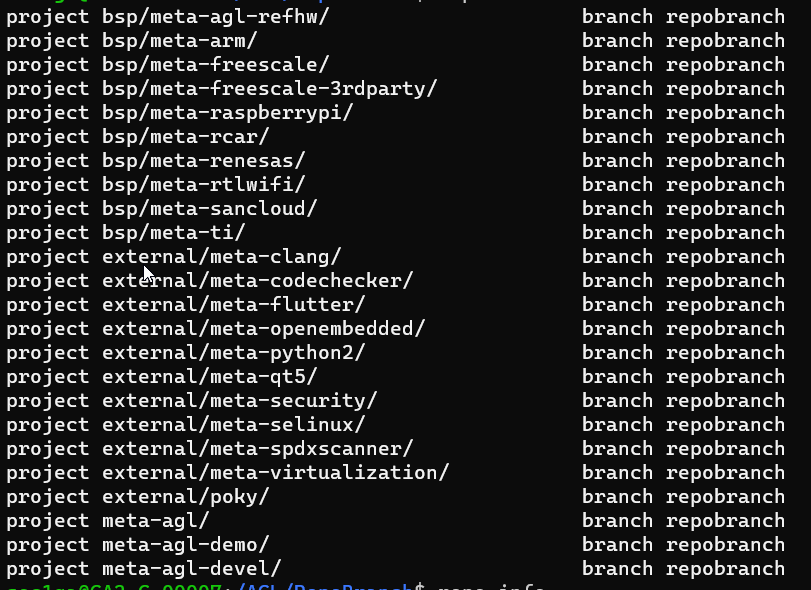
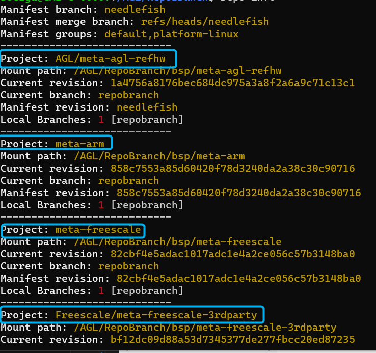

## Repo Branch
Repo Branch use same concept from Git Branch a Git branch is a new/separate version of the main repository.


Example you have a large project and you have multiple updates at same time, how would that work with branches:

	• Create a new branch called new-design, edit the code directly without impacting the main branch
	• EMERGENCY! There is an unrelated error somewhere else in the project that needs to be fixed ASAP!
	• Create a new branch from the main project called small-error-fix
	• Fix the unrelated error and merge the small-error-fix branch with the main branch
	• You go back to the new-design branch, and finish the work there
	• Merge the new-design branch with main (getting alerted to the small error fix that you were missing)

Branches allow you to work on different parts of a project without impacting the main branch.
When the work is complete, a branch can be merged with the main project.
You can even switch between branches and work on different projects without them interfering with each other.

## Branches in Repo

At this point you already create a repo and sync the project now to work with Branches using Repo next commands will help

To start a topic branch

```
repo start branchname --all
```

To verify that your new branch was created

```
repo status
```
Output



Using topic branches
To assign the branch to a particular project

```
repo start branch name project
```
Project can be listed using 

```
repo info
```



To switch back and forth among branches that you have created in your local work environment
```
git checkout branchname
```

To see a list of existing branches:

```
git branch
or...
repo branches
```

The name of the current branch will be preceded by an asterisk


## Create own Repo Project Branch 

Is time to create a own repo project branch, first we have to enter in "\.repo\manifest" folder, this folder contain the git repository with multiple manifest. 

Type the below commands to see a complete list of Branches from git manifest repository

```
git branch -a
```

Next step is create our own Branch, use next command

```
git checkout -b UniTestBranch
```
Next step is t print all the files in this folder we will use like reference 

```
la
```
Create a new manifest file using exiting manifest project 

```
cp needlefish_14.0.4.xml needlefish_14.0.4_University.xml
```
Check if new files was created successfully 

```
ls
```
We would like to save the new branch with new manifest to start working in out account, for this next steps are required 

Create commit and be ready to push
	
From GitHub create a empty repository 

 
	
	
 
	

 

```	
git push --all -u https://github.com/gitUser/UnitOwnRepoBranch.git
```

