# CAN

## History
The Controller Area Network (CAN) is a serial bus protocol originally developed by Robert Bosch GmbH in the late 1980s, goal was to make automobiles more reliable, safe and fuel efficient while decreasing wiring harness weight and complexity.

CAN protocol was officially released in 1986 at the Society of Automotive Engineers (SAE) congress in Detroit, Michigan.

## CAN Protocol 

The CAN protocol uses the Data Link Layer and the Physical Layer in the ISO - OSI model. There are also some higher-level protocols available for CAN, multi-casting and broadcasting is supported, CAN is most widely used in the automotive and industrial market segments. Typical applications for CAN are motor vehicles, utility vehicles, and industrial automation. 

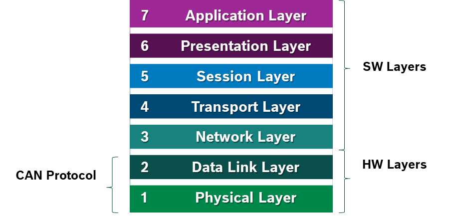

## CAN Physical Layer

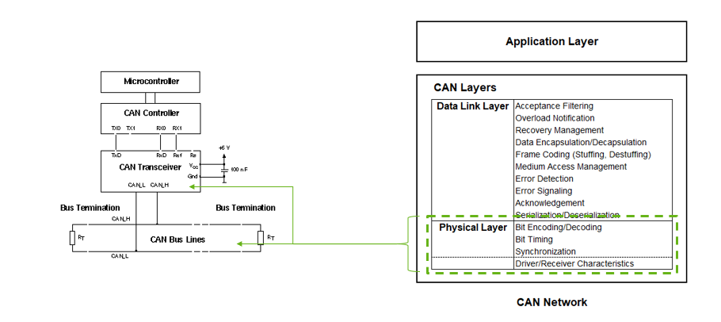

## CAN Datalink Layer

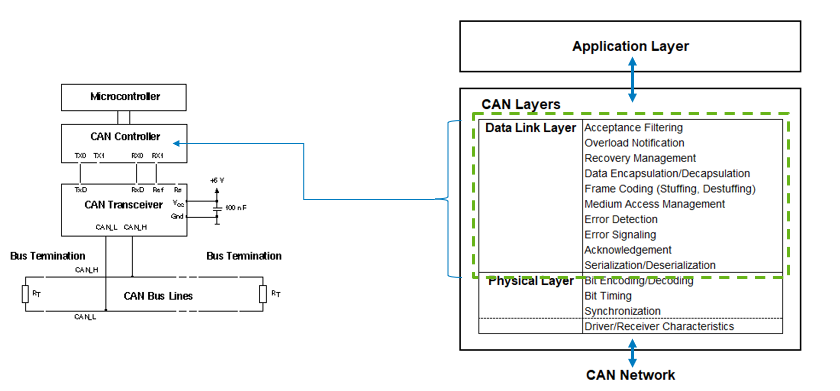

## CAN standars

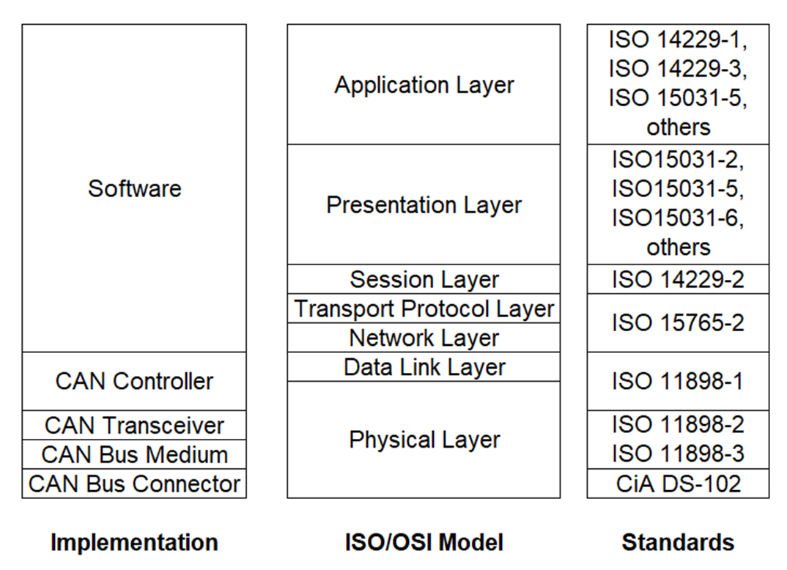

## CAN BUS
CAN transceivers handle the bus connection. A CAN transceiver always has two bus pins: one for the CAN high line (CANH) and one for the CAN low line (CANL). This is because physical signal transmission in a CAN network is symmetrical to achieve electromagnetic compatibility, and the physical transmission medium in a CAN network consists of two lines.

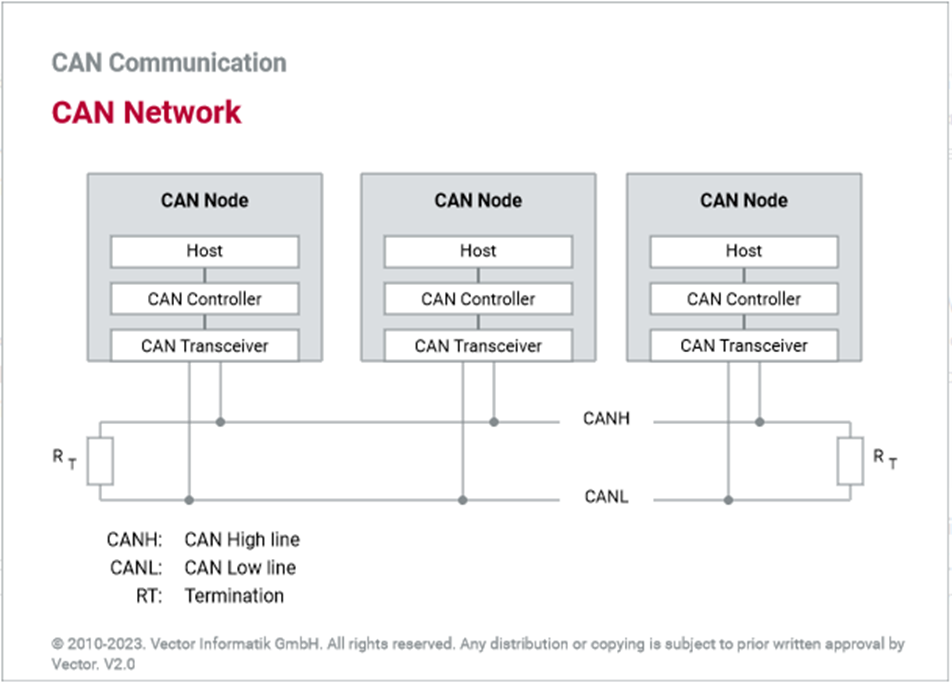

Due to the differential nature of transmission CAN is insensitive to electromagnetic interference, To reduce the sensitivity against electromagnetic interference even more, the bus lines can additionally be shielded.

## CAN Bus Connector

CAN in Automation user’s group (CiA) created a standard called CiA DS 102-1 which is based on the ISO 11898, 9-pin SUB-D connector for the connection of nodes to the CAN bus lines.

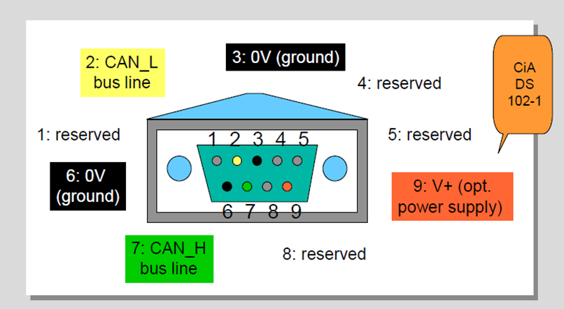

## CAN Bus Characteristics

There are two logic states on the bus called “Dominant” and “Recessive”.
The bus logic uses a "Wired-AND" mechanism:
dominant bit (logic level ’0’) overwrites the Recessive bit (logic level ‘1’).
As soon as one node transmits a dominant bit (zero), the bus is in the dominant state.
Only if all nodes transmit recessive bits (ones), the Bus is in the recessive state.

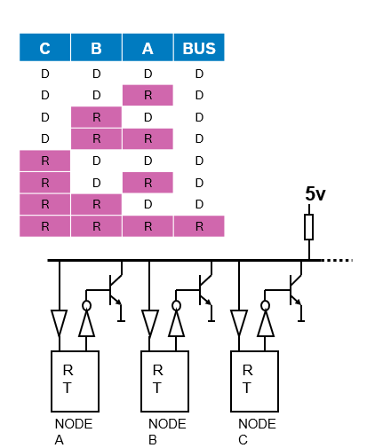

## CAN Frame

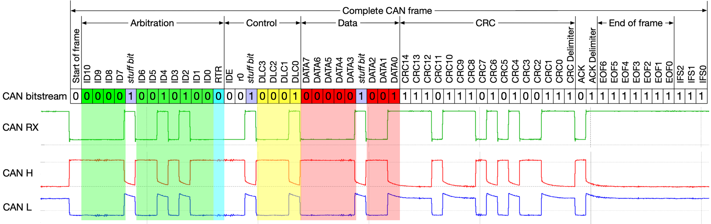

- **SoF (Start-of-Frame) bit** – Indicates the beginning  of a message with a dominant bit
- **Arbitration ID** – identifies the message and indicates the message’s priority. Frames come in 2 formats:
    **Standard** which uses and 11-bit arbitration ID.
    **Extended** which uses a 29-bit arbitration ID.
- **IDE (Identifier Extension) bit** – allows differentiation between standard and extended frames
- - **RTR (Remote Transmission Request)** bit – serves to differentiate a remote frame from a data frame. A dominant RTR bit indicates a data frame. A recessive RTR bit indicates a remote frame
- **DLC (Data Length Code)** – indicates the number of bytes the data field contains
- **Data field** – contains 0 to 8 bytes of data
- **CRC (Cyclic Redundancy Check)** -  contains 15-bit cyclic redundancy check code and a recessive delimiter bit. The CRC field is used for error detection
- **ACK (Acknowledgment) slot** – Any CAN controller that correctly receives the message sends an ACL bit  at the end of the message. The transmitting node checks for the presence of the ACK bit on the bus and reattempts transmission if no acknowledge is detected
- **SRR** – Substitute remote request. (Only in extended CAN frame)
- **R1, R0** – Reserved bits which must be set dominant , but accepted as either dominant or recessive. (Only in extended CAN frame)

## CAN Arbitration

Arbitration means the allocation of bus access rights, in other words, which ECU gets to transmit its message first. This evaluation occurs when several nodes start transmission on the bus at the same time.

Procedure:
    - All controllers monitor the bus while transmitting simultaneously.
    - A dominant bit (“0”) pulls the bus voltage level to zero.
    - When a controller transmits “1”, but observes “0” on the bus, it has lost arbitration.
    - Controllers who lost arbitration retreat immediately and retry later.
    - Arbitration is won by frame with lowest identifier = highest priority.

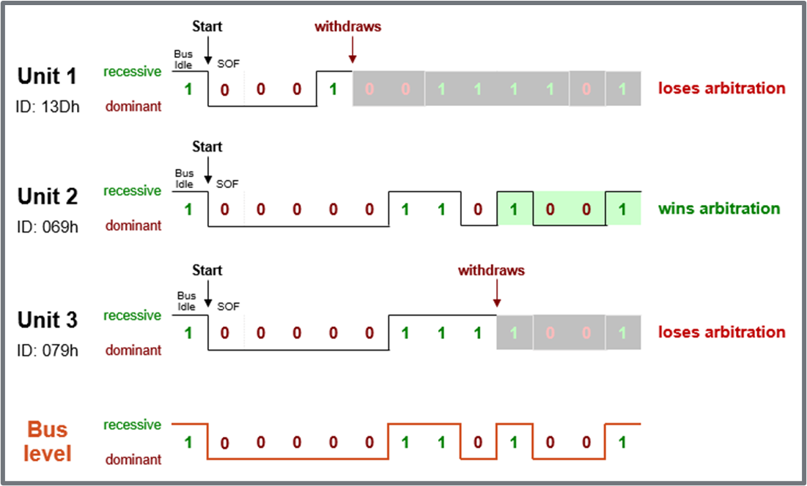

## CAN Bit Stuffing 

The idea behind bit stuffing is to provide a guaranteed edge on the signal so the receiver can resynchronize with the transmitter before minor clock discrepancies between the two nodes can cause a problem.

More than 5 consecutive bits of the same polarity in CAN frame between the start of Frame(SOF) to CRC field is considered as a faulty frame on CAN Bus and it signaled as stuff error on CAN line.

### How does Bit Stuffing work?
    - After five consecutive bits of same polarity, insert one bit of reverse polarity.
    - CRC code is calculated before bit stuffing is done.
    - Bit stuffing is done by the sender directly before transmission.
    - De-stuffing is done by the receiver directly after reception.
    - CRC code check is done after de-stuffing the frame.
    - Bit stuffing is applied to part of the frame from SOF to CRC field.

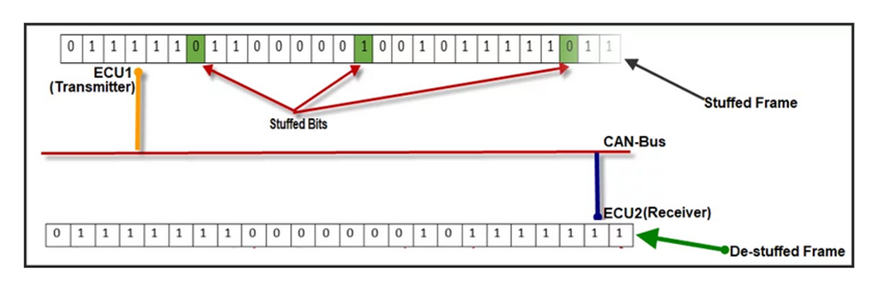

## CAN Error Types

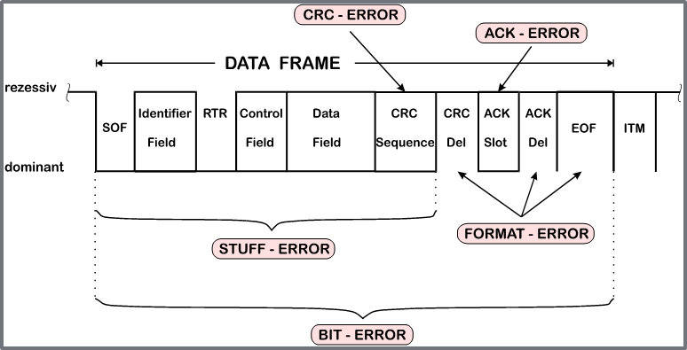

    - CRC            Calculated and received CRC Checksum must match
    - ACK            A frame must be Acknowledged by at least one other node (otherwise ACK-Error)
    - Form           Frame integrity is not preserved, No dominant bits allowed in CRC Delimiter, ACK Delimiter, End of Frame, Intermission (Form Error)
    - Bit Monitoring A transmitted bit must be correctly read back from the CAN bus (otherwise Bit Error) 
    - Bit stuffing   6 consecutive bits with same polarity are not allowed between Start Of Frame and CRC Delimiter (otherwise Bit Stuffing Error)

## CAN Error Manager
Immediately after an error detection, an Error Frame is transmitted.
There is no bit stuffing applied to Error Frames.
Other receivers are instantly informed that an error has occurred (unless they already found out).

