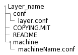

# Bitbake
It is a specific build tool (task executor) for yocto, Its main function is to read the configuration files that define the project, establish what task must be performed, and in which order, in dependencies function and for maximizing the efficiency.
## What kind of files support Bitbake
1. Recipes (.bb files)   
This contains information about a specific software component, and the task instructions depending the project.  
2. Classes (.bbclass)    
Information that is important to share between different recipes, for example autotools.  
3. Configurations (.conf)    
Define different variables of configuration that control what will do the build image (for example poky), this could include machine specifications, distribution configurations, compiler settings, and user configurations.
## Executing Taks
Bitbake executes task according to the provided metadata, which is stored in recipe (.bb) and related recipe (.bbappend), configuration files(.conf) and underlying include (.inc), and in class (.bbclass) files. The metadata provides Bitbake with instructions on what task to run and the dependencies between those tasks.
## Layers
[Layer Model](https://docs.yoctoproject.org/dev/overview-manual/yp-intro.html#the-yocto-project-layer-model)

Bitbake can combine all of these files in what is denominated as **layer**.  
A layer is a group of reusable components and recipes that are reusable in similar circumstances, for example, a user interface (UI) layer or a database layer. Each of these can be implemented by different development teams without affecting others layers functionality.  
The OpenEmbedded build system supports organizing Metadata into multiple layers, which allow to isolate different types of customizations from each other.  
## Layers Structure
Layers all have a similar structure, these could include additional directories in their structure depending their purpose. These can include any combination of recipes, templates, code, configuration files, and packages. In Linux development, there are three specific layer types:
### 1. Application-specific
Commonly used to manage applications and packages, and share the next structure:


### 2. Machine-specific
Used to maintain BSP and kernel-related modifications and requirements.  



### 3. Distribution-specific
Used to maintain policies related to your platform project distribution.  


## Bitbake-layers
* **bitbake-layers create-layer**  
This command allows us to create a new layer with the career path for recipes.
* **bitbake-layers add-layer**  
This command allows us to add the desired layer by specifying at the end of the command, for example: ```bitbake-layers add-layer meta-example```.
* **bitbake-layers show-layers**  
This command allows us to check what layers are added to our configuration file for player (you can find this file on your build folder inside of the conf folder).

## Execution
The main prop use for running Bitbake is to produce some kind of output such as a single installable package, kernel, software development kit, or even a full board-specific bootable Linux image.
Also, you can execute bitbake command with different options, for example: to compile a single recipe, capture or clear data, or simply return information about the execution environment.
>Note: Before executing Bitbake, you should check your configuration file **local. conf**, to corroborate some specific variables that could cause some damage in your build if these don't have a good definition.
