# Virtual CAN for AGL

## AGL and WSL VCAN connectivity
Here is the architecture overview for virtual CAN connectivity between AGL and WSL


## Enable VCAN in WSL
WSL by defualt doesn't have VCAN enable, the job now is get the WSL kernel source code (same version we have), enable VCAN from configuration and generate a new WSL Kernel version with VCAN support for our Project, Next are the commands you need follow to complete this activity 

**Get actual WSL Kernel version**
```
$ uname -r
```
Output:
 
- **$ uname -r**
    5.15.90.1-microsoft-standard-WSL2

Create a new folder inside your home folder(example **\home\user\WSLkernel**) and execute below command
```
$ git clone https://github.com/microsoft/WSL2-Linux-Kernel

$ cd WSL2-Linux-Kernel
```
Now we need use same WSL kernel version you get previously 
```
$ git checkout `WSL-version`
```
Example: **$ git checkout linux-msft-wsl-5.15.90.1**

Is time to start with the configuration, then create a config backup of your configuration
```
$ cat /proc/config.gz | gunzip > .config
```

Run below commands
```
$ make prepare modules_prepare

$ make menuconfig  
```
The second command will open Linux Kernel Menu where you will need navigate and enable vcan
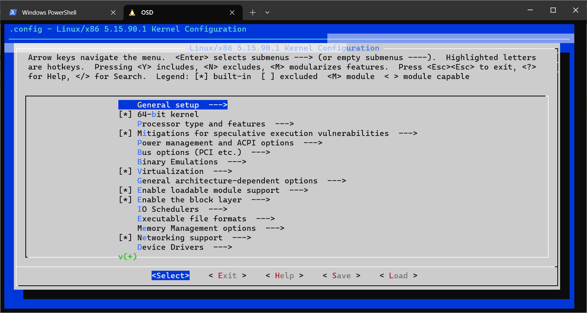

VCAN path and their dependency from Kernel configuration
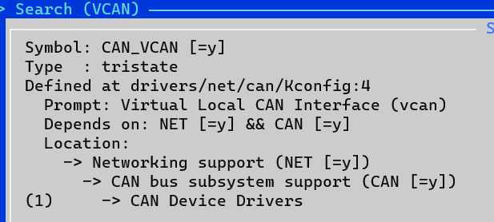

VCAN Configuration

Once you complete the configuration change, save your changes before exit

**Note: Is possible also change the configuration without Kernel menu, this is possible editing /proc/config file but you need know what are you are doing there**

Now is time to build the new kernel with the new configration 
```
$ make modules
```

Once previous command complete successfully, need install the new set of modules
```
# make modules_install
```
To ensure the new modules are available please take a look in **/lib/modules** folder, inside you should see a new file like below
```
$ls /lib/modules
5.15.90.1-microsoft-standard-WSL2+
```

Copy the new kernel to Windows folder we will need to boot WSL with this kernel 
```
cp vmlinux /mnt/c/Users/"myuser"/WSLKernel
```
Is time to stop WSL and change the configuration to boot WSL from new Kernel 
```
wsl --shutdown
```
Also we need update the .wslconfig from **C:\Users\"myuser"**, open the file and add the below line just replace the path from the kernel file you copy from WSL

```
#Use own kernel with socketCAN enable
kernel=C:\\Users\\"myuser"\\WSLKernel\\vmlinux2
```
Open WSL and once boot is complete check the actual version
```
$ uname -r
```
Output will be like:
- **$ uname -r**
    5.15.90.1-microsoft-standard-WSL2+

Run below commands to enable module component in your WSL
```
$ sudo modprobe vcan
```
Now create a virtual CAN network interface using this command
```
$ sudo ip link add dev can0 type vcan


```
## Install CAN Tools in WSL
Can-utils is a command line Linux utility that contains basic tools which can display, record, generate and replay CAN traffic. Along with these basic operations we can also calculate busload, convert log files and it also contain ISO 15765-2:2016 tools.

Install CAN Tools for test purpose with next command: 
```
sudo apt install can-utils
```

## CANdevStudio
CANdevStudio aims to be cost-effective replacement for CAN simulation software. It can work with variety of CAN hardware interfaces (e.g. Microchip, Vector, PEAK-Systems) or even without it (vcan and cannelloni) . CANdevStudio enables to simulate CAN signals such as ignition status, doors status or reverse gear by every automotive developer

Download the latest release (deb format) from https://github.com/GENIVI/CANdevStudio/releases, below is an example
```
wget https://github.com/GENIVI/CANdevStudio/releases/download/v1.2.2/CANdevStudio-1.2.2-Linux-standalone.deb
```

Once you have the deb file Install with next commands 

```
sudo apt install /path/of/installation/file/CANdevStudio-1.2.2-Linux-standalone.deb
```

Once installation is completed lunch CANdevStudio run CANdevStudio.sh script
```
/usr/CANdevStudio/CANdevStudio.sh > /dev/null 2>&1 &
```
Will come first CANdevStudio Windows like this

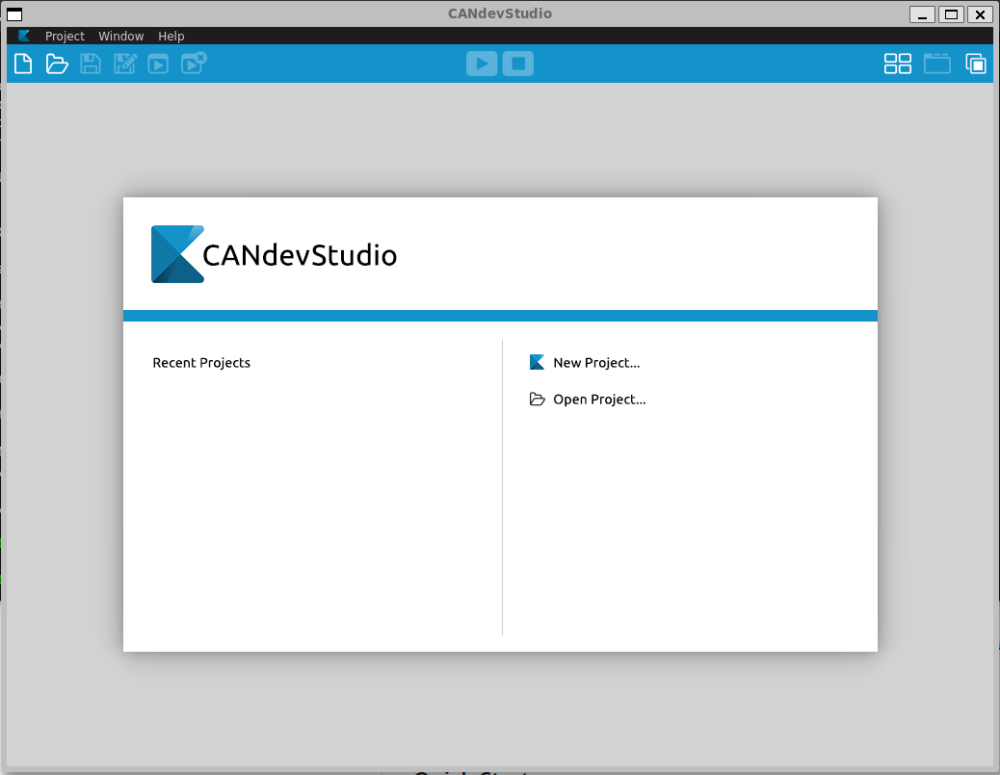

Here you have to create a new project

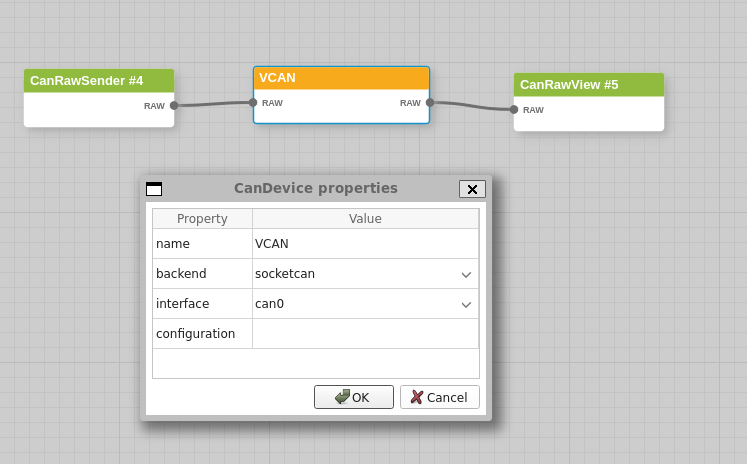

Add CAN load with CanRawSender block

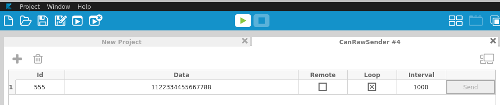

Check CAN log using candump tool (part of can-utils installed in previous section)

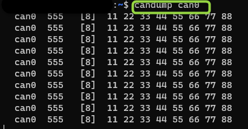

## AGL kernel Configuration for CAN connectivity

This section will provide the steps to config the AGL kernel to add CAN bus with specific device in order to connect with HOST machine (WSL). Guess require CAN configuration like in real usage

As previous kernel configuration we need open kernel menu
```
$ bitbake linux-yocto -c menuconfig
```


Now add Network Support for CAN, CAN Subsystem support, bitrate calculation support and kvaser_pci device for new Kernel

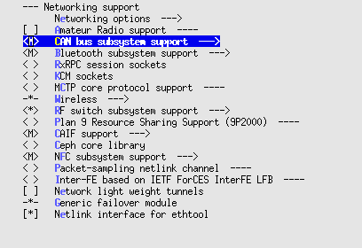

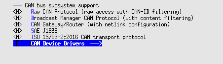

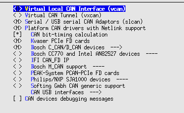

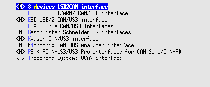

Save new configuration and build your Demo Project

## Enable VCAN in QEMU

An example of CAN connection between host with AGL (guess) is available in this page (CAN Bus Emulation): [CAN Bus Emulation](https://www.qemu.org/docs/master/system/devices/can.html)

Base on previous information we add the QEMU configuration for can0 and kvaser_pci device, below is the output command
```
/Folder/Path/of/your/BuildFolder/tmp/work/x86_64-linux/qemu-helper-native/1.0-r1/recipe-sysroot-native/usr/bin/qemu-system-x86_64 \
-device virtio-net-pci,netdev=net0,mac=52:54:00:12:35:02 \
-netdev user,id=net0,hostfwd=tcp::2222-:22,hostfwd=tcp::2323-:23,tftp=/AGL/UniversityNF/BUniversityClusterDemo/tmp/deploy/images/qemux86-64 -object rng-random,filename=/dev/urandom,id=rng0 \
-device virtio-rng-pci,rng=rng0 \
-drive file=/AGL/UniversityNF/BUniversityClusterDemo/tmp/deploy/images/qemux86-64/agl-cluster-university-qemux86-64-20230912224834.rootfs.ext4,if=virtio,format=raw -vga vmware \
-display default,show-cursor=on -usb \
-device usb-tablet -device virtio-rng-pci -vga virtio  -vnc :0 \
-machine q35 -cpu qemu64,+ssse3,+sse4.1,+sse4.2,+popcnt -smp 4 \
-m 2048 \
-serial mon:stdio -serial null  \
-kernel /AGL/UniversityNF/BUniversityClusterDemo/tmp/deploy/images/qemux86-64/bzImage \
-append 'root=/dev/vda rw  ip=dhcp console=ttyS0 console=ttyS1 oprofile.timer=1 tsc=reliable no_timer_check rcupdate.rcu_expedited=1 console=ttyS0,115200n8 quiet ' \
-object can-bus,id=canbus0 \
-object can-host-socketcan,id=canhost0,if=can0,canbus=canbus0 \
-device kvaser_pci,canbus=canbus0
```

## Demo

Run Host and AGL with CAN configuration described before.

Open CANdevStudio on Host and prepare a project to transmit different messages

Prepare AGL to test CAN network 

```
ip link set can0 type can bitrate 1000000
ip link set can0 up
```

Open candump tool for can0 you should see the messages sent by CANdevStudio from WSL(HOST) in AGL

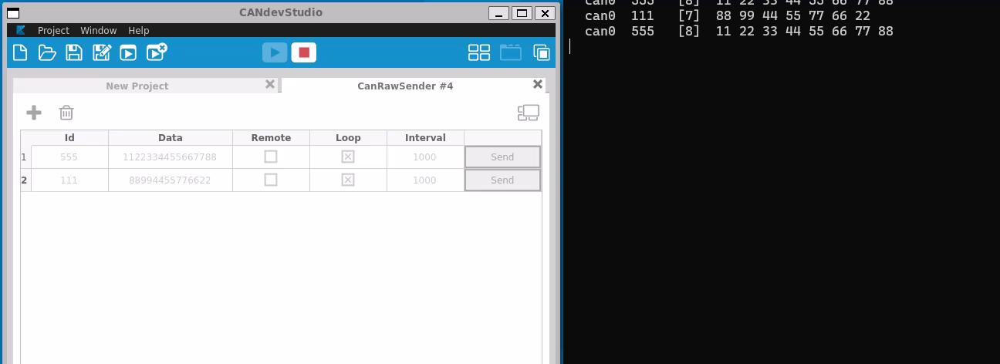

