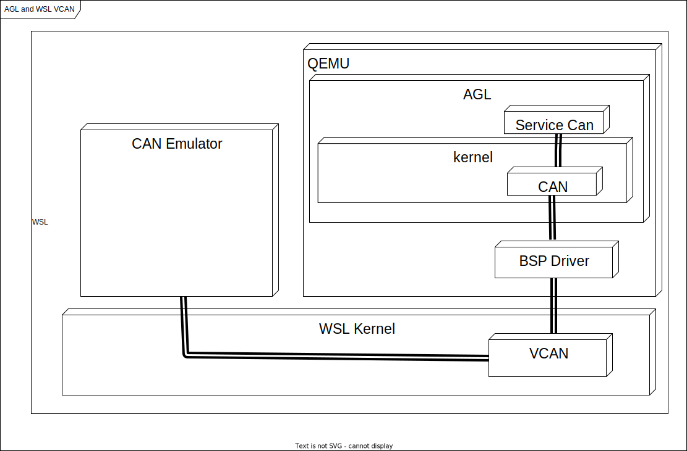
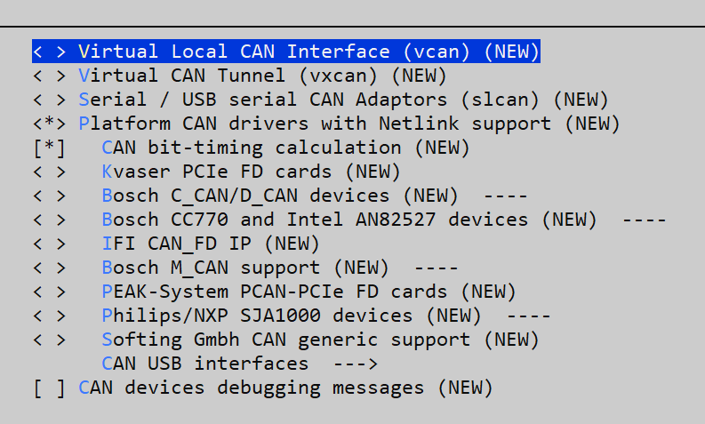

# Virtual CAN for AGL - WSL


## VCAN in Linux

### SocketCAN
The socketcan package is an implementation of CAN protocols (Controller Area Network) for Linux. CAN is a networking technology which has widespread use in automation, embedded devices, and automotive fields.SocketCAN uses the Berkeley socket API, the Linux network stack and implements the CAN device drivers as network interfaces. The CAN socket API has been designed as similar as possible to the TCP/IP protocols to allow programmers, familiar with network programming, to easily learn how to use CAN sockets.

How to use SocketCAN
Like TCP/IP, you first need to open a socket for communicating over a CAN network and pass PF_CAN as the first argument to the socket system call. Currently, there are two CAN protocols to choose from, the raw socket protocol and the broadcast manager (BCM). So to open a socket, you would write:

```
s = socket(PF_CAN, SOCK_RAW, CAN_RAW);
```
and:
```
s = socket(PF_CAN, SOCK_DGRAM, CAN_BCM);
```
respectively. After the successful creation of the socket, you would normally use the bind system call to bind the socket to a CAN interface. After binding (CAN_RAW) or connecting (CAN_BCM) the socket, you can read and write from/to the socket or use send, sendto, sendmsg and the recv* counterpart operations on the socket as usual. There are also CAN specific socket options described below.

The Classical CAN frame structure (aka CAN 2.0B), the CAN FD frame structure and the sockaddr structure are defined in include/linux/can.h:
```
struct can_frame {
        canid_t can_id;  /* 32 bit CAN_ID + EFF/RTR/ERR flags */
        union {
                /* CAN frame payload length in byte (0 .. CAN_MAX_DLEN)
                 * was previously named can_dlc so we need to carry that
                 * name for legacy support
                 */
                __u8 len;
                __u8 can_dlc; /* deprecated */
        };
        __u8    __pad;   /* padding */
        __u8    __res0;  /* reserved / padding */
        __u8    len8_dlc; /* optional DLC for 8 byte payload length (9 .. 15) */
        __u8    data[8] __attribute__((aligned(8)));
};
```
Remark: The len element contains the payload length in bytes and should be used instead of can_dlc. The deprecated can_dlc was misleadingly named as it always contained the plain payload length in bytes and not the so called 'data length code' (DLC).

To pass the raw DLC from/to a Classical CAN network device the len8_dlc element can contain values 9 .. 15 when the len element is 8 (the real payload length for all DLC values greater or equal to 8).

The alignment of the (linear) payload data[] to a 64bit boundary allows the user to define their own structs and unions to easily access the CAN payload. There is no given byteorder on the CAN bus by default. A read(2) system call on a CAN_RAW socket transfers a struct can_frame to the user space.

The sockaddr_can structure has an interface index like the PF_PACKET socket, that also binds to a specific interface:
```
struct sockaddr_can {
        sa_family_t can_family;
        int         can_ifindex;
        union {
                /* transport protocol class address info (e.g. ISOTP) */
                struct { canid_t rx_id, tx_id; } tp;

                /* J1939 address information */
                struct {
                        /* 8 byte name when using dynamic addressing */
                        __u64 name;

                        /* pgn:
                         * 8 bit: PS in PDU2 case, else 0
                         * 8 bit: PF
                         * 1 bit: DP
                         * 1 bit: reserved
                         */
                        __u32 pgn;

                        /* 1 byte address */
                        __u8 addr;
                } j1939;

                /* reserved for future CAN protocols address information */
        } can_addr;
};
```
To determine the interface index an appropriate ioctl() has to be used (example for CAN_RAW sockets without error checking):
```
int s;
struct sockaddr_can addr;
struct ifreq ifr;

s = socket(PF_CAN, SOCK_RAW, CAN_RAW);

strcpy(ifr.ifr_name, "can0" );
ioctl(s, SIOCGIFINDEX, &ifr);

addr.can_family = AF_CAN;
addr.can_ifindex = ifr.ifr_ifindex;

bind(s, (struct sockaddr *)&addr, sizeof(addr));

(..)
```
To bind a socket to all CAN interfaces the interface index must be 0 (zero). In this case the socket receives CAN frames from every enabled CAN interface. To determine the originating CAN interface the system call recvfrom may be used instead of read(2). To send on a socket that is bound to 'any' interface sendto is needed to specify the outgoing interface.

Reading CAN frames from a bound CAN_RAW socket (see above) consists of reading a struct can_frame:
```
struct can_frame frame;

nbytes = read(s, &frame, sizeof(struct can_frame));

if (nbytes < 0) {
        perror("can raw socket read");
        return 1;
}

/* paranoid check ... */
if (nbytes < sizeof(struct can_frame)) {
        fprintf(stderr, "read: incomplete CAN frame\n");
        return 1;
}

/* do something with the received CAN frame */
```
Writing CAN frames can be done similarly, with the write(2) system call:
```
nbytes = write(s, &frame, sizeof(struct can_frame));
When the CAN interface is bound to 'any' existing CAN interface (addr.can_ifindex = 0) it is recommended to use recvfrom(2) if the information about the originating CAN interface is needed:

struct sockaddr_can addr;
struct ifreq ifr;
socklen_t len = sizeof(addr);
struct can_frame frame;

nbytes = recvfrom(s, &frame, sizeof(struct can_frame),
                  0, (struct sockaddr*)&addr, &len);

/* get interface name of the received CAN frame */
ifr.ifr_ifindex = addr.can_ifindex;
ioctl(s, SIOCGIFNAME, &ifr);
printf("Received a CAN frame from interface %s", ifr.ifr_name);
To write CAN frames on sockets bound to 'any' CAN interface the outgoing interface has to be defined certainly:

strcpy(ifr.ifr_name, "can0");
ioctl(s, SIOCGIFINDEX, &ifr);
addr.can_ifindex = ifr.ifr_ifindex;
addr.can_family  = AF_CAN;

nbytes = sendto(s, &frame, sizeof(struct can_frame),
                0, (struct sockaddr*)&addr, sizeof(addr));
An accurate timestamp can be obtained with an ioctl(2) call after reading a message from the socket:

struct timeval tv;
ioctl(s, SIOCGSTAMP, &tv);
```
The timestamp has a resolution of one microsecond and is set automatically at the reception of a CAN frame.


### Virtual CAN Driver (vcan)
Linux offers a virtual local CAN interface than allow the transmission and reception of CAN frames without real CAN controller hardware. Virtual CAN network devices are usually named 'vcanX', like vcan0 vcan1 vcan2 ... When compiled as a module the virtual CAN driver module is called vcan.ko

Since Linux Kernel version 2.6.24 the vcan driver supports the Kernel netlink interface to create vcan network devices. The creation and removal of vcan network devices can be managed with the ip tool:

- Create a virtual CAN network interface:
```
     $ ip link add type vcan
```
- Create a virtual CAN network interface with a specific name 'vcan42':
```
     $ ip link add dev vcan42 type vcan
```
- Remove a (virtual CAN) network interface 'vcan42':
```
     $ ip link del vcan42
```
### CAN Network Device Driver Interface

The CAN network device driver interface provides a generic interface to setup, configure and monitor CAN network devices. The user can then configure the CAN device, like setting the bit-timing parameters, via the netlink interface using the program "ip" from the "IPROUTE2" utility suite. The following chapter describes briefly how to use it. Furthermore, the interface uses a common data structure and exports a set of common functions, which all real CAN network device drivers should use. The name of the module is can-dev.ko.

**Netlink interface to set/get devices properties**
The CAN device must be configured via netlink interface. The supported netlink message types are defined and briefly described in "include/linux/can/netlink.h". CAN link support for the program "ip" of the IPROUTE2 utility suite is available and it can be used as shown below:

Setting CAN device properties:
```
$ ip link set can0 type can help
Usage: ip link set DEVICE type can
    [ bitrate BITRATE [ sample-point SAMPLE-POINT] ] |
    [ tq TQ prop-seg PROP_SEG phase-seg1 PHASE-SEG1
      phase-seg2 PHASE-SEG2 [ sjw SJW ] ]

    [ dbitrate BITRATE [ dsample-point SAMPLE-POINT] ] |
    [ dtq TQ dprop-seg PROP_SEG dphase-seg1 PHASE-SEG1
      dphase-seg2 PHASE-SEG2 [ dsjw SJW ] ]

    [ loopback { on | off } ]
    [ listen-only { on | off } ]
    [ triple-sampling { on | off } ]
    [ one-shot { on | off } ]
    [ berr-reporting { on | off } ]
    [ fd { on | off } ]
    [ fd-non-iso { on | off } ]
    [ presume-ack { on | off } ]
    [ cc-len8-dlc { on | off } ]

    [ restart-ms TIME-MS ]
    [ restart ]

    Where: BITRATE       := { 1..1000000 }
           SAMPLE-POINT  := { 0.000..0.999 }
           TQ            := { NUMBER }
           PROP-SEG      := { 1..8 }
           PHASE-SEG1    := { 1..8 }
           PHASE-SEG2    := { 1..8 }
           SJW           := { 1..4 }
           RESTART-MS    := { 0 | NUMBER }
```
Display CAN device details and statistics:
```
$ ip -details -statistics link show can0
2: can0: <NOARP,UP,LOWER_UP,ECHO> mtu 16 qdisc pfifo_fast state UP qlen 10
  link/can
  can <TRIPLE-SAMPLING> state ERROR-ACTIVE restart-ms 100
  bitrate 125000 sample_point 0.875
  tq 125 prop-seg 6 phase-seg1 7 phase-seg2 2 sjw 1
  sja1000: tseg1 1..16 tseg2 1..8 sjw 1..4 brp 1..64 brp-inc 1
  clock 8000000
  re-started bus-errors arbit-lost error-warn error-pass bus-off
  41         17457      0          41         42         41
  RX: bytes  packets  errors  dropped overrun mcast
  140859     17608    17457   0       0       0
  TX: bytes  packets  errors  dropped carrier collsns
  861        112      0       41      0       0
```
More info to the above output:

"<TRIPLE-SAMPLING>"
Shows the list of selected CAN controller modes: LOOPBACK, LISTEN-ONLY, or TRIPLE-SAMPLING.

"state ERROR-ACTIVE"
The current state of the CAN controller: "ERROR-ACTIVE", "ERROR-WARNING", "ERROR-PASSIVE", "BUS-OFF" or "STOPPED"

"restart-ms 100"
Automatic restart delay time. If set to a non-zero value, a restart of the CAN controller will be triggered automatically in case of a bus-off condition after the specified delay time in milliseconds. By default it's off.

"bitrate 125000 sample-point 0.875"
Shows the real bit-rate in bits/sec and the sample-point in the range 0.000..0.999. If the calculation of bit-timing parameters is enabled in the kernel (CONFIG_CAN_CALC_BITTIMING=y), the bit-timing can be defined by setting the "bitrate" argument. Optionally the "sample-point" can be specified. By default it's 0.000 assuming CIA-recommended sample-points.

"tq 125 prop-seg 6 phase-seg1 7 phase-seg2 2 sjw 1"
Shows the time quanta in ns, propagation segment, phase buffer segment 1 and 2 and the synchronisation jump width in units of tq. They allow to define the CAN bit-timing in a hardware independent format as proposed by the Bosch CAN 2.0 spec (see chapter 8 of http://www.semiconductors.bosch.de/pdf/can2spec.pdf).

"sja1000: tseg1 1..16 tseg2 1..8 sjw 1..4 brp 1..64 brp-inc 1 clock 8000000"
Shows the bit-timing constants of the CAN controller, here the "sja1000". The minimum and maximum values of the time segment 1 and 2, the synchronisation jump width in units of tq, the bitrate pre-scaler and the CAN system clock frequency in Hz. These constants could be used for user-defined (non-standard) bit-timing calculation algorithms in user-space.

"re-started bus-errors arbit-lost error-warn error-pass bus-off"
Shows the number of restarts, bus and arbitration lost errors, and the state changes to the error-warning, error-passive and bus-off state. RX overrun errors are listed in the "overrun" field of the standard network statistics.

**Setting the CAN Bit-Timing**
The CAN bit-timing parameters can always be defined in a hardware independent format as proposed in the Bosch CAN 2.0 specification specifying the arguments "tq", "prop_seg", "phase_seg1", "phase_seg2" and "sjw":
```
$ ip link set canX type can tq 125 prop-seg 6 \
                            phase-seg1 7 phase-seg2 2 sjw 1
```
If the kernel option CONFIG_CAN_CALC_BITTIMING is enabled, CIA recommended CAN bit-timing parameters will be calculated if the bit- rate is specified with the argument "bitrate":
```
$ ip link set canX type can bitrate 125000
```
Note that this works fine for the most common CAN controllers with standard bit-rates but may fail for exotic bit-rates or CAN system clock frequencies. Disabling CONFIG_CAN_CALC_BITTIMING saves some space and allows user-space tools to solely determine and set the bit-timing parameters. The CAN controller specific bit-timing constants can be used for that purpose. They are listed by the following command:
```
$ ip -details link show can0
...
  sja1000: clock 8000000 tseg1 1..16 tseg2 1..8 sjw 1..4 brp 1..64 brp-inc 1
```
**Starting and Stopping the CAN Network Device**
A CAN network device is started or stopped as usual with the command "ifconfig canX up/down" or "ip link set canX up/down". Be aware that you must define proper bit-timing parameters for real CAN devices before you can start it to avoid error-prone default settings:
```
$ ip link set canX up type can bitrate 125000
```
A device may enter the "bus-off" state if too many errors occurred on the CAN bus. Then no more messages are received or sent. An automatic bus-off recovery can be enabled by setting the "restart-ms" to a non-zero value, e.g.:
```
$ ip link set canX type can restart-ms 100
```
Alternatively, the application may realize the "bus-off" condition by monitoring CAN error message frames and do a restart when appropriate with the command:
```
$ ip link set canX type can restart
```
Note that a restart will also create a CAN error message frame (see also Network Problem Notifications).

**CAN FD (Flexible Data Rate) Driver Support**
CAN FD capable CAN controllers support two different bitrates for the arbitration phase and the payload phase of the CAN FD frame. Therefore a second bit timing has to be specified in order to enable the CAN FD bitrate.

Additionally CAN FD capable CAN controllers support up to 64 bytes of payload. The representation of this length in can_frame.len and canfd_frame.len for userspace applications and inside the Linux network layer is a plain value from 0 .. 64 instead of the CAN 'data length code'. The data length code was a 1:1 mapping to the payload length in the Classical CAN frames anyway. The payload length to the bus-relevant DLC mapping is only performed inside the CAN drivers, preferably with the helper functions can_fd_dlc2len() and can_fd_len2dlc().

The CAN netdevice driver capabilities can be distinguished by the network devices maximum transfer unit (MTU):
```
MTU = 16 (CAN_MTU)   => sizeof(struct can_frame)   => Classical CAN device
MTU = 72 (CANFD_MTU) => sizeof(struct canfd_frame) => CAN FD capable device
```
The CAN device MTU can be retrieved e.g. with a SIOCGIFMTU ioctl() syscall. N.B. CAN FD capable devices can also handle and send Classical CAN frames.

When configuring CAN FD capable CAN controllers an additional 'data' bitrate has to be set. This bitrate for the data phase of the CAN FD frame has to be at least the bitrate which was configured for the arbitration phase. This second bitrate is specified analogue to the first bitrate but the bitrate setting keywords for the 'data' bitrate start with 'd' e.g. dbitrate, dsample-point, dsjw or dtq and similar settings. When a data bitrate is set within the configuration process the controller option "fd on" can be specified to enable the CAN FD mode in the CAN controller. This controller option also switches the device MTU to 72 (CANFD_MTU).

The first CAN FD specification presented as whitepaper at the International CAN Conference 2012 needed to be improved for data integrity reasons. Therefore two CAN FD implementations have to be distinguished today:

ISO compliant: The ISO 11898-1:2015 CAN FD implementation (default)

non-ISO compliant: The CAN FD implementation following the 2012 whitepaper

Finally there are three types of CAN FD controllers:

ISO compliant (fixed)

non-ISO compliant (fixed, like the M_CAN IP core v3.0.1 in m_can.c)

ISO/non-ISO CAN FD controllers (switchable, like the PEAK PCAN-USB FD)

The current ISO/non-ISO mode is announced by the CAN controller driver via netlink and displayed by the 'ip' tool (controller option FD-NON-ISO). The ISO/non-ISO-mode can be altered by setting 'fd-non-iso {on|off}' for switchable CAN FD controllers only.

Example configuring 500 kbit/s arbitration bitrate and 4 Mbit/s data bitrate:
```
$ ip link set can0 up type can bitrate 500000 sample-point 0.75 \
                               dbitrate 4000000 dsample-point 0.8 fd on
$ ip -details link show can0
5: can0: <NOARP,UP,LOWER_UP,ECHO> mtu 72 qdisc pfifo_fast state UNKNOWN \
         mode DEFAULT group default qlen 10
link/can  promiscuity 0
can <FD> state ERROR-ACTIVE (berr-counter tx 0 rx 0) restart-ms 0
      bitrate 500000 sample-point 0.750
      tq 50 prop-seg 14 phase-seg1 15 phase-seg2 10 sjw 1
      pcan_usb_pro_fd: tseg1 1..64 tseg2 1..16 sjw 1..16 brp 1..1024 \
      brp-inc 1
      dbitrate 4000000 dsample-point 0.800
      dtq 12 dprop-seg 7 dphase-seg1 8 dphase-seg2 4 dsjw 1
      pcan_usb_pro_fd: dtseg1 1..16 dtseg2 1..8 dsjw 1..4 dbrp 1..1024 \
      dbrp-inc 1
      clock 80000000
```
Example when 'fd-non-iso on' is added on this switchable CAN FD adapter:

```
can <FD,FD-NON-ISO> state ERROR-ACTIVE (berr-counter tx 0 rx 0) restart-ms 0
```

**Supported CAN Hardware**
Please check the "Kconfig" file in "drivers/net/can" to get an actual list of the support CAN hardware. On the SocketCAN project website (see SocketCAN Resources) there might be further drivers available, also for older kernel versions.


## AGL and WSL VCAN connectivity
Here is the VCAN Overview for AGL and WSL CAN connectivity 



## Enable VCAN in WSL
WSL by defualt doesn't have VCAN enable, the job now is get the WSL kernel source code (same version we have), enable VCAN from configuration and generate a new WSL Kernel version with VCAN support for our Project, Next are the commands you need follow to complete this activity 

**Get actual WSL Kernel version**
```
$ uname -r
```
Output:
 
- **$ uname -r**
    5.15.90.1-microsoft-standard-WSL2

Create a new folder inside your home folder(example **\home\user\WSLkernel**) and execute below command
```
$ git clone https://github.com/microsoft/WSL2-Linux-Kernel

$ cd WSL2-Linux-Kernel
```
Now we need use same WSL kernel version you get previously 
```
$ git checkout `WSL-version`
```
Example: **$ git checkout linux-msft-wsl-5.15.90.1**

Is time to start with the configuration, first create a config backup 
```
$ cat /proc/config.gz | gunzip > .config
```

Run below commands
```
$ make prepare modules_prepare

$ make menuconfig  
```
The second command will open Linux Kernel Menu where you will need navigate and enable vcan


VCAN path and their dependency from Kernel configuration


VCAN Configuration

Once you complete the configuration change, save your changes before exit

**Note: Is possible also change the configuration direcly in /proc/config file but you need know what are you are doing there**

Now is time to build the new kernel configration 
```
$ make modules
```

Once previous command complete sucessfully, need intall the new set of modules
```
# make modules_install
```
To ensure the new modules are available please take a look in **/lib/modules** folder inside this folder a new file like this
```
$ls /lib/modules
5.15.90.1-microsoft-standard-WSL2+
```

Now copy the new kernel to Windows folder we will need to boot WSL with this kernel 
```
cp vmlinux /mnt/c/Users/"myuser"/WSLKernel
```
Is time to stop WSL and change the configuration to boot WSL from new Kernel 
```
wsl --shutdown
```
Now we need update the .wslconfig from **C:\Users\"myuser"**, open the file and add the below line just replace the path from the kernel file you copy from WSL

```
#Use own kernel with socketCAN enable
kernel=C:\\Users\\"myuser"\\WSLKernel\\vmlinux2
```
Open your WSL and oce boot is complete from terminal check the actual version you should see 
```
$ uname -r
```
Will see something like  this:
- **$ uname -r**
    5.15.90.1-microsoft-standard-WSL2

Run below commands to enable module component in your WSL
```
$ sudo modprobe vcan
```
Now create a virtual CAN network interface using this command
```
$ ip link add type vcan
```

## CANdevStudio
CANdevStudio aims to be cost-effective replacement for CAN simulation software. It can work with variety of CAN hardware interfaces (e.g. Microchip, Vector, PEAK-Systems) or even without it (vcan and cannelloni) . CANdevStudio enables to simulate CAN signals such as ignition status, doors status or reverse gear by every automotive developer


## Enable VCAN in QEMU


## AGL kernel Configuration for CAN connectivity


## Demo


