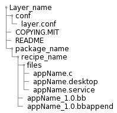
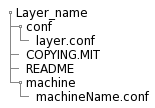
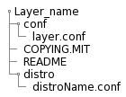

# Bitbake
It is a specific build tool (task executor) for yocto, It's main function is to read the configuration files that difines the project, establish what task must be performed, and in which order, in dependencies function and for maximize the efficience.
## What kind of files support Bitbake
1. Recipes(.bb files)  
This contain information abot a specific software component, and the task instructions depending the project.  
2. Classes (.bbclass)  
Information that is important to share between diferents recipes, for example autotools.  
3. Configurations (.conf)  
Define diferent variables of configuration that control what will do the build image (for example poky), this could include machine specifications, distribution configurations, compiler settings, and user configurations.  
## Executing Taks
Bitbake executes task according to the provided metadata, which is stored in recipe (.bb) and related recipe (.bbappend), configuration files(.conf) and underlying include (.inc), and in class (.bbclass) files. The metadata provides Bitbake with instructions on what task to run and the dependencies between those tasks.
## Layers
https://docs.yoctoproject.org/dev/overview-manual/yp-intro.html#the-yocto-project-layer-model

Bitbake can combine all of this files in what is denominated as **layer**.
A layer is a group of reusable components and recipes that are reusable in similar circunstances, for example, a user interface (UI) layer or a database layer. Each of these can be implemented by different developments teams without affecting others layers functionality.
The OpenEmbedded build system supports organizing Metadata into multiple layers, which allow to isolate different types of customizations froms each other. 
## Layers Structure
Layers all have similar structure, these could include additional directories in their structurew depending their porpuse. These can include any combination of recipes, templates, code, configuration files, and packages. InLinux development, there are three specific layer types:
### 1. Application-specific
Commonly used to manage applications and packages, and share the next structure:



### 2. Machine-specific
Used to mantain BSP and kernel-related modifications and requirements.



### 3. Distribution-specific
Used to mantain policies related to your platform project distribution.



## Bitbake-layers
* **bitbake-layers create-layer**  
This command allow us to create a new layer with the correr path for recipes.
* **bitbake-layers add-layer**  
This command allows us to add the desired layer by specifying ath the end of the command, for example: ```bitbake-layers add-layer meta-example```.
* **bitbake-layers show-layers**  
This command allow us to check what layers are added on our configuration file for bblayer (you can find this file on your build folder inside of the conf folder).

## Execution
The main propuse for running Bitbake is to produce some kind of output such as a single installable package, kernel, software development kit, or even a full board-specific bootable Linux image.
Also you can execute bitbake command with diferents options, for example: to compile single recipe, capture or clear data, or simply return information about execution environment.
>Note: Before execute Bitbake, you should check your configuration file **local.conf**, to corroborate some specific varibales that could cause some damage in your build if these dont have a well definition.
